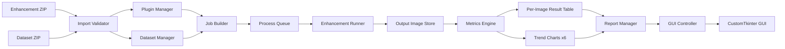

# Easy-Enhance Specification

## 系統概述

Easy-Enhance 為一套影像增強評估工作檯，採用 Python 與 CustomTkinter 建置桌面 GUI，並以 plugin architecture、job queue 與 metrics engine 作為核心設計。

## 系統整體架構

### 架構分層

- Presentation Layer：CustomTkinter GUI
- Controller Layer：流程控制與事件調度
- Core Service Layer：驗證、插件管理、資料集管理、任務排程、執行器、指標引擎、報表管理
- Resource Layer：ZIP、工作區、輸出圖像、報表與暫存檔案

### 模組圖



## 模組規格

| 模組 | 功能 |
|---|---|
| Import Validator | 驗證 method ZIP 與 dataset ZIP 的完整性與格式 |
| Plugin Manager | 載入 enhancement plugin，解析 manifest 與入口函式 |
| Dataset Manager | 解壓與索引資料集影像 |
| Job Builder | 將 method 與 dataset 影像組合成標準化 jobs |
| Queue Manager | 管理待處理、執行中、完成、失敗任務 |
| Enhancement Runner | 執行單一 job 的影像增強 |
| Metrics Engine | 計算 PSNR、SSIM、LPIPS、NIQE、EME、BRISQUE |
| Report Manager | 輸出表格、摘要與六張趨勢圖 |
| GUI Controller | 控制 GUI 與後端狀態同步 |
| CustomTkinter GUI | 呈現輸入、執行狀態、結果與圖表 |

## 資料流程規格

### 輸入

系統須接受兩類 ZIP：

- enhancement method ZIP
- dataset ZIP

### 解壓與驗證

- method ZIP 應至少包含 `main.py`、`manifest.json`、`description.md`
- dataset ZIP 應至少包含影像資料夾與資料集描述檔
- 驗證失敗時須中止後續流程並顯示錯誤訊息

### Job 規格

每筆 job 至少應包含：

- `job_id`
- `method_id`
- `dataset_id`
- `input_image_path`
- `output_image_path`
- `status`
- `runtime`
- `error_message`
- `created_at`
- `finished_at`

## 功能需求

### 匯入管理

- 支援 method ZIP 匯入
- 支援 dataset ZIP 匯入
- 顯示檔名、路徑、驗證狀態
- 完成解壓與工作區建立

### 插件管理

- 採 plugin 架構載入方法
- 驗證 plugin manifest
- 驗證主入口函式
- 顯示 method 名稱、版本、描述、作者
- 不符合規格時拒絕載入

### 批次執行

- 建立 jobs
- 啟動批次執行
- 顯示 queue 狀態
- 顯示進度條
- 記錄每筆 job runtime 與錯誤資訊
- 支援停止與重新執行

### 評估功能

- 計算 PSNR
- 計算 SSIM
- 計算 LPIPS
- 計算 NIQE
- 計算 EME
- 計算 BRISQUE
- 保存逐圖 metrics records

### 結果輸出

- 顯示逐圖 metrics table
- 顯示六張 line charts
- 支援匯出 CSV
- 支援匯出圖表
- 顯示執行 log 與錯誤 log

## 非功能需求

### 可維護性

- GUI、controller、core、metrics、plugins 必須分離
- 需採模組化與 class-based 架構

### 可擴充性

- 能新增 methods 而不需修改核心流程
- 能新增 metrics 與資料集 parser
- 能擴充多 methods 比較模式

### 穩定性

- 單筆 job 失敗不得導致整批任務終止
- 系統需保留失敗訊息與 log

### 效能

- queue 以傳遞路徑與 metadata 為主，避免直接搬運大型影像物件
- 第一版可先採單 worker，後續再導入 multiprocessing

### 可用性

- 輸入、執行、結果、log 區域需清楚分離
- 錯誤訊息需可讀且可追蹤

## GUI 規格

### 畫面配置

- 左側：輸入與設定區
- 中間：queue 與進度區
- 右上：results table
- 右下：chart tabs 與 log 區

### 建議元件

| 區域 | 元件 |
|---|---|
| 輸入區 | `CTkFrame`、`CTkButton`、`CTkEntry`、`CTkLabel` |
| Queue 區 | `CTkScrollableFrame`、`CTkProgressBar` |
| Result Table 區 | `ttk.Treeview` 或相容表格元件 |
| Charts 區 | `CTkTabview` |
| Log 區 | `CTkTextbox` |

## 插件規格

### ZIP 結構

```text
sample_method.zip
└── sample_method/
    ├── main.py
    ├── manifest.json
    ├── requirements.txt
    ├── description.md
    └── method/
```

### manifest.json 範例

```json
{
  "method_name": "sample_low_light_enhancer",
  "version": "1.0.0",
  "author": "author_name",
  "entry_file": "main.py",
  "entry_function": "run",
  "input_type": "single_image",
  "output_type": "single_image",
  "supported_formats": ["png", "jpg", "jpeg"],
  "description": "Sample enhancement plugin for Easy-Enhance"
}
```

### 入口函式規格

```python
def run(input_path: str, output_path: str, config: dict | None = None) -> dict:
    return {
        "status": "success",
        "runtime": 0.0,
        "message": "done"
    }
```

## Metrics 輸出格式

| 欄位 | 說明 |
|---|---|
| `image_id` | 影像識別碼 |
| `image_name` | 原始檔名 |
| `method_id` | 使用之增強方法 |
| `psnr` | PSNR 值 |
| `ssim` | SSIM 值 |
| `lpips` | LPIPS 值 |
| `niqe` | NIQE 值 |
| `eme` | EME 值 |
| `brisque` | BRISQUE 值 |
| `runtime` | 該圖處理耗時 |
| `status` | success / failed |
| `note` | 額外訊息 |

## 輸出檔案規格

- `results.csv`
- `summary.csv`
- `psnr_line.png`
- `ssim_line.png`
- `lpips_line.png`
- `niqe_line.png`
- `eme_line.png`
- `brisque_line.png`
- `run_log.txt`

## 建議資料夾結構

```text
easy_enhance/
├── main.py
├── pyproject.toml
├── README.md
├── requirements.txt
├── app/
│   ├── controller/
│   ├── core/
│   ├── gui/
│   ├── metrics/
│   └── utils/
├── plugins/
├── workspace/
└── tests/
```
